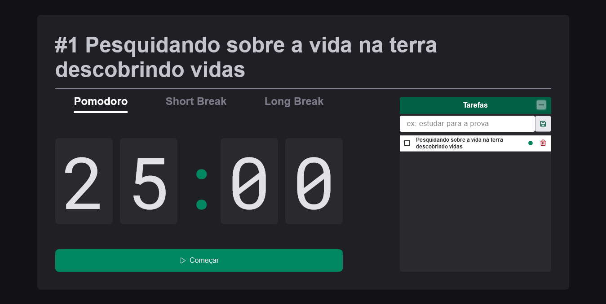

# Pomodoro

> Projeto feito baseado no projeto da trilha da Rocketseat(um timer), e agora utilizando React Js + typescript foi feito um sistema que executa a técnica pomodoro, é possível também adicionar tarefas a serem concluidas durante a técnica pomodoro. O usuário pode:
> * Criar uma tarefa;
> * Excluir uma tarefa;
> * Concluir uma tarefa;
> * Priorizar tarefa

## 💻 Pré-requisitos

Antes de começar, verifique se você atendeu aos seguintes requisitos:

* Ter instalado a versão mais recente do Node js;

## ☕ Usando timer

Para usar timer:
acesse
[pomodoro](https://netosouza22.github.io/pomodoro/)

 > yarn install ou npm i para instalar os pacotes
 > yarn dev para iniciar o projeto

## 🤝 Colaboradores

Agradecemos às seguintes pessoas que contribuíram para este projeto:

<table>
  <tr>
    <td align="center">
      <a href="#">
         
        
          <b>Neto Sousa</b>
        
      </a>
    </td>
  </tr>
</table>

## 📝 Licença

Esse projeto está sob licença. Veja o arquivo [LICENÇA](LICENSE.md) para mais detalhes.
